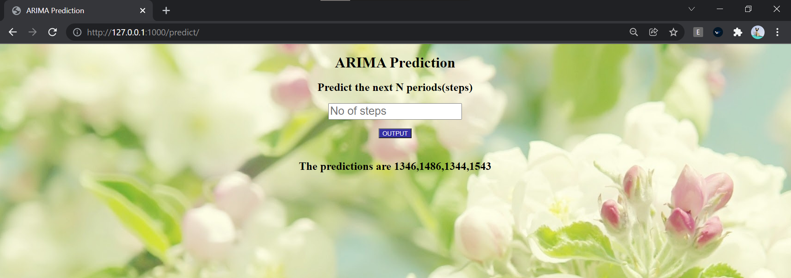

# Auto-ARIMA-on-weather-data

In this case, we've implemented the auto ARIMA algorithm on this time-series based dataset to predict the possible value of energy a given number of steps ahead.<br>
The link to the Google colab code is:<br> 
https://colab.research.google.com/drive/10LjiCJJ4aNEpLjh6xaT9JYfhowCL-Q8o?usp=sharing <br>
This model has been pickled followed by deployment using Flask.<br>
The source files for the deployment have been made available here as well.

# Deploying ML Model using Flask

## Project Structure
>This has three major parts :

1. model.py - This contains code for our Machine Learning model to predict wind speed based  on data in 'TexasTurbine.csv' file.

2. app.py - This contains Flask APIs that receives the no. of steps(hours) through GUI or API calls, computes the precited value based on our model and returns it.

3. template - This folder contains the HTML template (index.html) to allow user to no. of steps(hours) detail and displays the predicted wind speed.


## Installation

Use the package manager [pip](https://pip.pypa.io/en/stable/) to install flask.

```bash
pip install flask
```

## Running the project

 1. Ensure that you are in the project home directory. Create the machine learning model by running below command from <br>
 command prompt -

```bash
python model.py
```
- This would create a serialized version of our model into a file model.pkl


2. Run app.py using below command to start Flask API
```bash
python app.py
```

3. Navigate to URL and you should be able to view the homepage.



